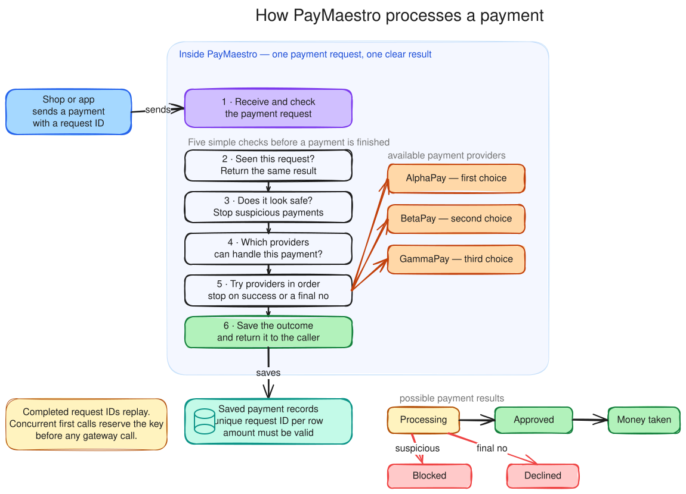

# PayMaestro — Mini Payment Orchestration API

PayMaestro is a study project. It shows how payment orchestration works. One API stands in front of several payment gateways. The gateways are simulated and run inside the same process. No real money moves.

## What the software does

- It accepts one card payment at a time, from an authenticated merchant.
- It selects a payment provider (a "gateway") that supports the currency and the amount.
- It sends the charge to that gateway.
- If the gateway refuses for a temporary reason, it tries the next gateway.
- If a card shows a fraud pattern, it rejects the payment before any gateway call.
- It stores a record of every attempt, so each result can be explained later.

I built it, spec-first, to learn how orchestration platforms serve the iGaming space. The design decisions are in [docs/SPEC.md](docs/SPEC.md).

## The flow of one payment



*Editable source: [`docs/architecture.excalidraw`](docs/architecture.excalidraw) — open it on [excalidraw.com](https://excalidraw.com) and export the SVG again after changes.*

## Prerequisites

- The .NET 10 SDK.
- The `dotnet-ef` tool, to apply migrations or build a migration bundle: `dotnet tool install --global dotnet-ef`.

## Configuration

| Key | What it does | Default |
|---|---|---|
| `ConnectionStrings:DefaultConnection` | The SQLite database. | `Data Source=paymaestro.db` |
| `PaymentSecurity:FingerprintSecret` | The secret that keys the request fingerprint. | none — it is required |
| `Authentication:Authority` | The JSON Web Token (JWT) issuer. Empty selects the `Authentication:Schemes:Bearer` section. | empty |
| `Authentication:Audience` | The JWT audience. It is read only when an authority is set. | empty |
| `GatewayRouting:Gateways` | Name, priority, supported currencies and amount cap of each gateway. | three gateways |

`PaymentSecurity:FingerprintSecret` has no default. The application refuses to build the fingerprint generator without it, and the value is kept out of every `appsettings` file. For local work, put it in user secrets:

```bash
dotnet user-secrets set "PaymentSecurity:FingerprintSecret" "local-development-fingerprint-secret" \
  --project src/PayMaestro.API
```

## Migrations

The schema comes from Entity Framework Core migrations. The application never creates the schema on its own.

- In the `Development` environment it applies the migrations at startup, so local work needs no extra step.
- In every other environment, apply them before the application starts:

```bash
dotnet ef migrations bundle \
  --project src/PayMaestro.Infrastructure \
  --startup-project src/PayMaestro.API \
  --output efbundle

./efbundle --connection "Data Source=/path/to/paymaestro.db"
```

The merchant-scoping migration **deletes rows written before payments were scoped per merchant**. Those rows belong to no merchant, no backfill could attribute them truthfully, and keeping them under a pseudo-tenant would break their idempotency contract anyway: the merchant that created them could never reach them again. The deletion happens inside the migration, so applying it to a database with history is a visible decision. The migration is irreversible — rolling back means restoring from a backup.

A local database created by an older checkout (which used `EnsureCreated` instead of migrations) has no migrations history and cannot be migrated. Delete the `.db` file and let the application recreate it.

## Authentication and authorization

The API uses JSON Web Token (JWT) bearer authentication. Every payment endpoint sits behind a policy:

| Endpoint | Policy | Required `scope` |
|---|---|---|
| `POST /api/payments` | `payments:write` | `payments:write` |
| `GET /api/payments/{id}` | `payments:read` | `payments:read` or `payments:write` |
| `POST /api/payments/{id}/reconcile` | `payments:reconcile` | `payments:reconcile` |

An authorization server sends granted scopes as one space-delimited string under `scope`, or under `scp`. `ScopeClaimTransformation` splits that into one claim per scope before authorization runs, so a real token is accepted and not only a token whose scopes already arrive split.

The merchant comes from the token, never from the request. The API reads the `merchant_id` claim, and falls back to `NameIdentifier`. No body field and no header can change it. A merchant reaches only its own payments: a read or a reconcile for another merchant's payment answers `404`.

Every policy also requires a usable merchant identity. A token whose merchant claim is missing, or equals the reserved id `legacy-unscoped` — which an earlier revision of the scoping migration used to group unattributable rows — answers `403` on either claim route.

Each merchant gets its own fixed window of 120 requests per minute. Above that the answer is `429` with a ProblemDetails body. The window is held in memory, so each instance counts on its own.

### A token for local work

```bash
dotnet user-jwts create --project src/PayMaestro.API \
  --claim merchant_id=merchant-1 \
  --scope payments:write --scope payments:read --scope payments:reconcile
```

Send the printed token as `Authorization: Bearer <token>`.

## Idempotency: one key, at most one charge

Every request must send an `Idempotency-Key` header. The key must be 1 to 100 characters, and may contain only letters, numbers, `.`, `_`, `:` and `-`. Anything else answers `400`.

- The service inserts the payment row, in status `Processing`, **before** it contacts any gateway. This insert is committed first. It claims the key.
- The key is unique per merchant: a unique index covers `MerchantId` and `IdempotencyKey`. Two merchants may use the same key at the same time and get two independent payments.
- When two requests race with the same key, the index picks one winner. The loser has charged nothing. It reads the winner's row and answers from it.
- A key that is still in flight returns `409 Conflict`. The service does not charge again.
- A finished key replays the stored result: the same payment id, status, attempt list and UTC creation time.
- The same key with a different request returns `422`.

### The request fingerprint

The service stores a keyed HMAC-SHA256 fingerprint of the request, not the request. It covers, in a canonical order: `amount`, `currency`, `customerId`, `customerIp`, `merchantId`, `merchantReference` and `paymentMethodToken`.

The payment method token is itself an HMAC-SHA256 of the merchant and the digits of the card number. The full card number is never stored. Two different card numbers produce two different tokens even when they share the first six digits and the last four, so replaying a changed card under an old key answers `422`.

## Fraud screening

Fraud rules implement the `IFraudRule` contract in the Domain layer. They run after the key is claimed and before any gateway call. Each hit is stored as a `FraudFlag` row.

One rule is active: **decline velocity**. It counts declined attempts for one card, identified by the first six digits and the last four, **within the calling merchant only**. Three or more declines in 24 hours block the card. The payment ends `FraudRejected` with zero gateway calls. The rule reads the clock through `TimeProvider`, so a test can move time instead of waiting.

The merchant scope is part of the rule, not an optimisation: without it a card declined at another merchant would reject this merchant's payment, and would leak that other merchant's card activity.

## Routing and the cascade

The gateway list lives in `appsettings.json`: name, priority, supported currencies and amount cap. The service tries the eligible gateways in priority order. This is the cascade. The rules are:

- **Soft decline** (for example insufficient funds) or **gateway error**: try the next eligible gateway.
- **Hard decline** (for example a stolen card): stop at once. No other gateway is tried.
- **No answer**: stop and set the payment to `RequiresReconciliation`. A second charge could bill the customer twice.
- **No eligible gateway** for the currency or amount: the payment is `Declined` with zero attempts.

## The attempt record and the crash window

Each attempt is written before the gateway call, not after it:

1. The attempt is stored with status `Processing` and its provider idempotency key.
2. That write is committed.
3. The gateway is called.
4. The result is written to the same attempt row, and its status becomes `Completed`.

A process that stops between step 2 and step 4 leaves an attempt in `Processing`, holding the exact key the gateway saw. The provider idempotency key is derived, never random:

```
{gatewayName}:{attemptOrder}:{SHA-256 of merchantId and idempotencyKey}
```

The merchant and the client key are hashed rather than concatenated. Both are caller-supplied, so a concatenated key could outgrow its column and throw *after* the reservation was committed — leaving a payment in `Processing` with no attempt, which nothing could then settle. Hashing keeps the key a constant length whatever the caller sends.

## Recovery of stale attempts

`PaymentAttemptRecoveryWorker` runs inside the API. Every minute it looks for payments in `Processing` whose newest attempt has been in `Processing` for more than two minutes, and takes at most 25 of them per pass. For each it asks the gateway what happened to that attempt's provider idempotency key. It never charges again.

- Approved at the provider: the payment becomes `Captured`.
- Still no answer: the payment becomes `RequiresReconciliation`.
- The gateway that took the attempt is no longer registered: the payment becomes `RequiresReconciliation` and the missing gateway is logged. It cannot be queried automatically, and left in `Processing` it would head this batch forever and starve every payment behind it.
- Anything else — hard decline, soft decline, gateway error, or no record of the key: the payment becomes `Declined`.

The same pass also sweeps payments stuck in `Processing` for more than two minutes with **no attempt at all** — a reservation whose flow died before its cascade committed a first attempt, for example on a failing fraud rule. The attempt row is committed before any gateway call, so with no attempt no gateway was ever contacted: those payments are declined outright, and no money can have moved.

Declining on a soft decline or a gateway error is a deliberate divergence from the live cascade, which would carry those to the next acquirer. Recovery has no cascade left to continue, and leaving the payment in `Processing` would strand it: its key would answer `409` forever and nothing would pick it up again. The merchant retries under a new idempotency key.

The two-minute cutoff assumes no gateway call outlives it, which holds for the in-process mocks. Before any real, out-of-process gateway is introduced, each attempt needs a timeout below that cutoff, and a first `not_found` answer must not become a definitive decline without an explicit temporal policy — otherwise recovery could declare a charge dead while its request is still in flight.

Each payment is committed on its own. A stale concurrency stamp on one payment therefore cannot discard the outcomes already committed for the payments before it; the pass stops there, and the next one starts from a clean unit of work.

## Reconciliation on request

`POST /api/payments/{id}/reconcile` settles a payment whose charge got no answer. It asks the same gateway what happened to the key that attempt already used. It never charges again.

- The provider reports the charge as approved: the payment becomes `Captured`.
- The provider has no record of the key: the payment becomes `Declined`. No money moved.
- The provider still gives no answer: the payment does not change.
- The payment is already settled: the call changes nothing and returns `200`.
- The payment is still `Processing`: the call returns `409`. The recovery worker settles that one.
- Two reconcilers work on the same payment: a concurrency stamp makes the one with stale data lose with `409`.

## Audit records

- Every gateway attempt is stored: gateway name, order, status, result code, duration and the provider idempotency key. Attempts with no answer are stored too.
- Only the card's first six digits and last four digits are stored, together with the payment method token. The full card number is never stored.
- The attempt and fraud-flag tables point to the payment with `Restrict` foreign keys. The database refuses to delete a payment that still has attempts or flags.

## Payment lifecycle

The `Payment` aggregate guards its own state transitions. An invalid transition throws a domain exception.

- Main path: `Pending → Processing → Authorized → Captured`.
- Terminal branches: `Declined` and `FraudRejected`.
- `RequiresReconciliation` holds a charge with no answer. Reconciliation settles it to `Captured` or `Declined`.
- There is no path back from `Captured`. Refunds are not implemented.

## API

Errors use ASP.NET Core ProblemDetails, produced by one global exception filter.

| Endpoint | What it does | Answers |
|---|---|---|
| `POST /api/payments` | Creates and processes a payment. Requires the `Idempotency-Key` header. | `200` with status and attempt list · `400` invalid input, missing header or malformed key · `401` no token · `403` missing scope or unusable merchant identity · `409` key still in flight · `422` key reused with a different request · `429` over the merchant's rate limit |
| `GET /api/payments/{id}` | Returns the payment and its attempt list. | `200` · `401` · `403` · `404` with an empty body |
| `POST /api/payments/{id}/reconcile` | Settles a payment whose charge got no answer. | `200` · `401` · `403` · `404` unknown id or another merchant's payment · `409` still processing, or a stale reconciler · `503` gateway no longer registered |
| `GET /health` | Reports service health. Needs no token. | `200` `Healthy` · `503` `Unhealthy` |

The health check opens a connection to the database and reports `Unhealthy` when that fails.

## Architecture

Clean architecture: `API → Application → Domain ← Infrastructure`.

- **Domain**: entities, the state machine, the `IdempotencyKey` value object, the derived provider idempotency key, and all contracts — gateways, fraud rules, repositories (read / write / update) and the unit of work. No external references.
- **Application**: one use case class per operation, plus `GatewayCascade`, which owns the cascade policy and sits beside the use case that runs it.
- **Infrastructure**: Entity Framework Core with SQLite, the three mock gateways and the keyed fingerprint generator.
- **API**: MVC controllers, a global exception filter, the security registration, the health check, the recovery worker and Swagger.

Repository capabilities state what a caller may do with what they get back. Reads whose results are only inspected sit on `IPaymentReadOnlyRepository`; the stale-attempt query, whose results the recovery use case mutates and commits, sits on `IPaymentUpdateOnlyRepository`.

## Tests

```bash
dotnet test
```

74 xUnit tests cover:

- the payment state machine and its guards;
- the cascade policy: approve, soft decline, hard decline, error and unknown outcome;
- the idempotency race: two concurrent requests against a real SQLite file, one charge only;
- replay, `409` and `422`, including a changed card that shares the first six and last four digits;
- merchant isolation: the same key used by two merchants, one merchant's payment invisible to another, and decline velocity that ignores another merchant's declines;
- the migration contract: a database with pre-scoping rows loses them when the merchant-scoping migration runs, verified against a database that actually holds one;
- stuck-payment prevention: the provider idempotency key stays inside its column for any merchant id, and an oversized merchant id is refused before the reservation is committed;
- recovery: soft declines and unknown keys settle instead of stranding the payment, a reservation that never reached an attempt is declined, an unregistered gateway parks the payment in reconciliation instead of starving the batch, a batch leaves nothing in `Processing`, and one concurrency conflict does not discard outcomes already committed;
- scope parsing: space-delimited `scope` and `scp` claims satisfy the real policies, and the reserved merchant id answers `403` on both claim routes;
- reconciliation, including the stale concurrent reconciler;
- the HTTP contract over a real pipeline (`WebApplicationFactory`): the empty `404` body, the refused anonymous caller, the health endpoint, the `422` ProblemDetails body and each documented card scenario.

## Run it

```bash
dotnet run --project src/PayMaestro.API
```

The API listens on `http://localhost:5225`. With the default launch profile the browser opens Swagger; otherwise open `http://localhost:5225/swagger`.

Send `POST /api/payments` with a bearer token, the header `Idempotency-Key: <any-key>` and this body:

```json
{
  "merchantReference": "ORDER-001",
  "customerId": "customer-42",
  "amount": 50,
  "currency": "EUR",
  "cardNumber": "4111111111111111",
  "customerIp": "185.89.10.20"
}
```

This card ends in `1111`, so AlphaPay soft-declines it and BetaPay approves it. The response is `200 Captured` with two attempts. The last digits of the card select the mock behaviour:

| Card ending | Behaviour with the default routing |
|---|---|
| `0000` | Hard decline on AlphaPay — the cascade stops, the payment is `Declined` with one attempt |
| `1111` | Soft decline on AlphaPay, approved on BetaPay — `Captured` with two attempts |
| `2222` | Soft decline on AlphaPay and BetaPay, approved on GammaPay — `Captured` with three attempts |
| `3333` | Soft decline on AlphaPay and BetaPay, error on GammaPay — no gateway left, `Declined` with three attempts |
| `9999` | The charge settles at the provider, but no answer comes back — `RequiresReconciliation` |
| anything else | Approved on the first eligible gateway |

More things to try:

- Send `6000` EUR. AlphaPay has a `5000` cap, so BetaPay takes the charge directly.
- Send a `JPY` amount. No gateway supports it. The payment is `Declined` with zero attempts.
- Send the same `Idempotency-Key` again after completion. The stored result comes back. Change any field of the body and the answer is `422`.
- Decline a card three times under one merchant. The fourth payment on that card is `FraudRejected` with an empty attempt list.
- Send card `…9999`, then call `POST /api/payments/{id}/reconcile`. The payment becomes `Captured` with no second charge.

## Known limits

- The gateways are mocks running in this process. No real acquirer is contacted and no money moves.
- Stored `FraudFlag` rows are not part of any API response. A `FraudRejected` payment returns an empty attempt list and does not name the rule.
- The card country and the customer IP country are stored as `MT`. There is no BIN table and no GeoIP lookup.
- The rate limit is held in memory, so each instance counts on its own.
- The recovery worker takes no lease, so every instance runs it. A query moves no money, so a duplicate query is safe.
- A replayed response carries the same data, but the number format of `amount` can differ from the first response (for example `50` and `50.0`).
- Refunds and partial captures are not implemented.

## Related certifications

- [iGaming Academy — Anti-Fraud & Payments Handling (2026)](docs/certificates/Daniel_Silva_Anti_Fraud_and_Payments_Handling_2026.pdf)
- iGaming Academy — Anti-Money Laundering and Counter Terrorist Financing for Online Operators (2026)

## What's next

More fraud rules on the same `IFraudRule` contract, as specified in [docs/SPEC.md](docs/SPEC.md): geo mismatch and amount anomaly. Then refunds, and CI/CD to Azure Container Apps — the same pipeline as my [Sports Betting API](https://github.com/DeVFirmino/SportsBetting), which runs there today.
