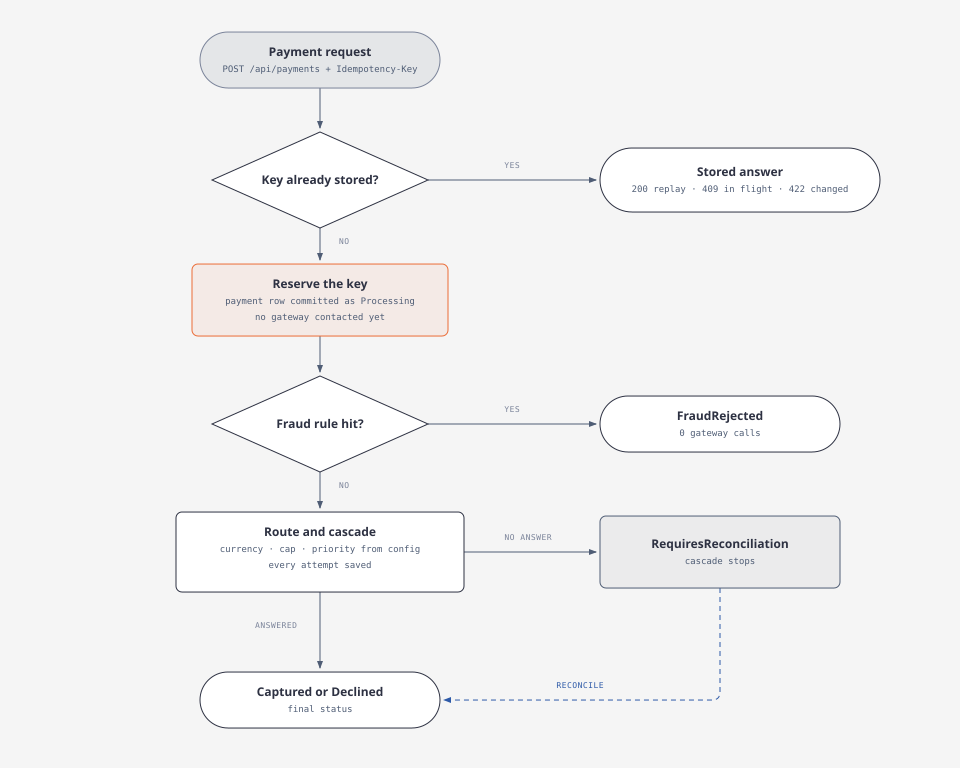

# PayMaestro — Mini Payment Orchestration API

PayMaestro is a study project. It shows how payment orchestration works. One API stands in front of several payment gateways. The gateways are simulated and run inside the same process. No real money moves.

## What the software does

- It accepts one card payment request at a time.
- It selects a payment provider (a "gateway") that supports the currency and the amount.
- It sends the charge to that gateway.
- If the gateway refuses for a temporary reason, it tries the next gateway.
- If a card shows a fraud pattern, it rejects the payment before any gateway call.
- It stores a record of every attempt, so each result can be explained later.

I built it over a weekend, spec-first, to learn how orchestration platforms serve the iGaming space. The design decisions are in [docs/SPEC.md](docs/SPEC.md).

## The flow of one payment



## Idempotency: one key, at most one charge

Every request must send an `Idempotency-Key` header.

- The service inserts the payment row, in status `Processing`, **before** it contacts any gateway. This insert is committed first. It claims the key.
- When two requests race with the same key, a unique index picks one winner. The loser has charged nothing. It reads the winner's row and answers from it.
- A key that is still in flight returns `409 Conflict`. The service does not charge again.
- A finished key replays the stored result: the same payment id, status, attempt list and UTC creation time.
- The same key with a different payload returns `422`. Every field counts: amount, currency, card number, customer, merchant reference and customer IP.
- Each gateway attempt sends a derived key: `{idempotency-key}:{gateway}:{attempt}`. The provider can then recognise a retry of the same attempt.

## Fraud screening

Fraud rules implement the `IFraudRule` contract in the Domain layer. They run after the key is reserved and before any gateway call. Each hit is stored as a `FraudFlag` row.

One rule is active: **decline velocity**. It counts declined attempts for one card, identified by BIN and last four digits. Three or more declines in 24 hours block the card. The payment ends `FraudRejected` with zero gateway calls.

## Routing and the cascade

The gateway list lives in `appsettings.json`: name, priority, supported currencies and amount cap. The service tries the eligible gateways in priority order. This is the cascade. The rules are:

- **Soft decline** (for example insufficient funds) or **gateway error**: try the next eligible gateway.
- **Hard decline** (for example a stolen card): stop at once. No other gateway is tried.
- **No answer**: stop and set the payment to `RequiresReconciliation`. A second charge could bill the customer twice.
- **No eligible gateway** for the currency or amount: the payment is `Declined` with zero attempts.

## Reconciliation

`POST /api/payments/{id}/reconcile` settles a payment whose charge got no answer. It asks the same gateway what happened to the derived key that attempt already used. It never charges again.

- The provider reports the charge as approved: the payment becomes `Captured`.
- The provider has no record of the key: the payment becomes `Declined`. No money moved.
- The provider still gives no answer: the payment does not change.
- The payment is already settled: the call changes nothing and returns `200`.
- Two reconcilers work on the same payment: a concurrency stamp makes the one with stale data lose with `409`.

## Audit records

- Every gateway attempt is stored: gateway name, order, result code, duration and the derived key. Attempts with no answer are stored too.
- Only the card BIN (first six digits) and the last four digits are stored. The full card number is never stored.
- The attempt and fraud-flag tables point to the payment with `Restrict` foreign keys. The database refuses to delete a payment that still has attempts or flags.

## Payment lifecycle

The `Payment` aggregate guards its own state transitions. An invalid transition throws a domain exception.

- Main path: `Pending → Processing → Authorized → Captured`.
- Terminal branches: `Declined` and `FraudRejected`.
- `RequiresReconciliation` holds a charge with no answer. Reconciliation settles it to `Captured` or `Declined`.
- There is no path back from `Captured`. Refunds are not implemented.

## API

| Endpoint | What it does | Answers |
|---|---|---|
| `POST /api/payments` | Creates and processes a payment. Requires the `Idempotency-Key` header. | `200` with status and attempt list · `400` invalid input or missing header · `409` key still in flight · `422` key reused with a different payload |
| `GET /api/payments/{id}` | Returns the payment and its attempt list. | `200` · `404` with an empty body |
| `POST /api/payments/{id}/reconcile` | Settles a payment whose charge got no answer. | `200` · `404` unknown id · `409` still processing · `503` gateway no longer registered |

## Architecture

Clean architecture: `API → Application → Domain ← Infrastructure`.

- **Domain**: entities, the state machine and all contracts — gateways, fraud rules, repositories (read / write / update) and the unit of work. No external references.
- **Application**: one use case class per operation, plus the `CascadeExecutor`, which owns the cascade policy.
- **Infrastructure**: EF Core with SQLite, and the three mock gateways.
- **API**: MVC controllers, a global exception filter and Swagger.

## Tests

```bash
dotnet test
```

36 xUnit tests cover:

- the payment state machine;
- the cascade policy: approve, soft decline, hard decline, exception and unknown outcome;
- the idempotency race: two concurrent requests against a real SQLite file, one charge only;
- replay, `409` and `422` answers, including the replayed UTC timestamp;
- reconciliation, including the stale concurrent reconciler;
- the HTTP contract over a real pipeline (`WebApplicationFactory`), including the empty `404` body.

The decline-velocity rule has no automated test yet. I verified it by hand against the running API.

## Run it

```bash
dotnet run --project src/PayMaestro.API
```

The API listens on `http://localhost:5225`. With the default launch profile, the browser opens Swagger. Otherwise, open `http://localhost:5225/swagger`.

Send `POST /api/payments` with the header `Idempotency-Key: <any-uuid>` and this body:

```json
{
  "merchantReference": "ORDER-001",
  "customerId": "customer-42",
  "amount": 50,
  "currency": "EUR",
  "cardNumber": "4111111111111111",
  "customerIp": "185.89.10.20"
}
```

Note: this card ends in `1111`, so AlphaPay soft-declines it and BetaPay approves it. The response is `200 Captured` with a trail of two attempts. The last digits of the card select the mock behaviour:

| Card ending | Behaviour |
|---|---|
| `0000` | Hard decline everywhere — the cascade stops, the payment is `Declined` |
| `1111` | Soft decline on AlphaPay — the cascade moves to BetaPay |
| `2222` | Soft decline on BetaPay |
| `3333` | Gateway error on GammaPay |
| `9999` | The charge settles at the provider, but no answer comes back — `RequiresReconciliation` |
| anything else | Approved on the first eligible gateway |

More things to try:

- Send `6000` EUR. AlphaPay has a `5000` cap, so BetaPay takes the charge directly.
- Send a `JPY` amount. No gateway supports it. The payment is `Declined` with zero attempts.
- Send the same `Idempotency-Key` again after completion. The stored result comes back. Change any field of the body and the answer is `422`.
- Decline card `…0000` three times. The fourth payment on that card is `FraudRejected` with an empty attempt list.
- Send card `…9999`, then call `POST /api/payments/{id}/reconcile`. The payment becomes `Captured` with no second charge.

## Known limits

- Stored `FraudFlag` rows are not part of any API response. A `FraudRejected` payment returns an empty attempt list and does not name the rule.
- A missing `Idempotency-Key` header returns `400` with the framework's standard validation body, not the documented `ErrorResponse` shape.
- A payment that a crashed process left in `Processing` cannot be settled. Reconcile returns `409` for it.
- A replayed response carries the same data, but the number format of `amount` can differ from the first response (for example `50` and `50.0`).

## Related certifications

- [iGaming Academy — Anti-Fraud & Payments Handling (2026)](docs/certificates/Daniel_Silva_Anti_Fraud_and_Payments_Handling_2026.pdf)
- iGaming Academy — Anti-Money Laundering and Counter Terrorist Financing for Online Operators (2026)

## What's next

More fraud rules on the same `IFraudRule` contract, as specified in [docs/SPEC.md](docs/SPEC.md): geo mismatch and amount anomaly. Then refunds, and CI/CD to Azure Container Apps — the same pipeline as my [Sports Betting API](https://github.com/DeVFirmino/SportsBetting), which runs there today.
