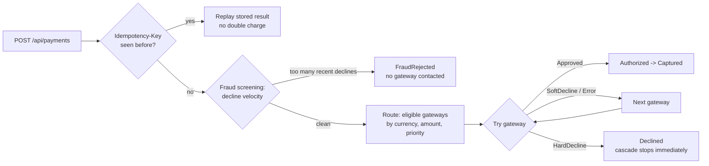

# PayMaestro

A payment orchestration API that simulates the core engine of a **payment service provider (PSP)**: it receives card payments from merchants, screens them for fraud, routes them to the best acquiring gateway, and automatically fails over to the next gateway when one declines — while guaranteeing the customer is never charged twice.

Built with **.NET 10**, **ASP.NET Core**, **EF Core (SQLite)**, xUnit, and organized with **Clean Architecture**.

## What it does, exactly

A merchant (an online shop, an iGaming operator, …) doesn't talk to card networks directly — it sends payments to a PSP. A good PSP doesn't depend on a single acquirer either: if one gateway declines or is down, it *cascades* the payment to the next one, because every recovered payment is revenue the merchant would otherwise lose. But cascading blindly is dangerous — retrying a *stolen* card on more acquirers is exactly what fraudsters want. PayMaestro implements that balance:



Every gateway attempt (gateway name, order, result, response code, duration) is persisted and returned in the response — a full audit trail per payment.

## Anti-fraud controls

| Control | What it protects against |
|---|---|
| **Decline-velocity rule** — a card with 3+ declined attempts in 24h is rejected *before any gateway is contacted*, and a `FraudFlag` records which rule fired | Card testing / enumeration attacks, where fraudsters probe stolen card numbers with small payments |
| **Hard-decline stop** — a hard decline (e.g. response code 43, stolen card) ends the cascade immediately; soft declines (insufficient funds) may retry elsewhere | "Card shopping": retrying a flagged card across acquirers until one lets it through |
| **Idempotency keys** — same key replays the stored result; same key with a *different* payload is rejected with `422` | Double charges from network retries, and key-reuse tampering |
| **Immutable attempt log** — every attempt is recorded on the payment, including fraud rejections | Disputes, chargebacks and compliance investigations need a complete trail |

## Payment lifecycle

`Pending → Authorized → Captured` on success; `Pending → Declined` when all routes are exhausted or a hard decline occurs; `Pending → FraudRejected` when a fraud rule fires. Transitions are enforced by the `Payment` entity itself — an invalid transition (e.g. capturing an unauthorized payment) throws and maps to `409 Conflict`.

## Project structure

```
src/
  PayMaestro.Domain/          Entities (Payment, PaymentAttempt, FraudFlag), enums,
                              gateway/repository abstractions, domain exceptions
  PayMaestro.Application/     PaymentOrchestrator (flow), CascadeExecutor (failover),
                              DTOs, gateway routing options
  PayMaestro.Infrastructure/  EF Core DbContext, repositories, unit of work,
                              simulated gateways (AlphaPay, BetaPay, GammaPay)
  PayMaestro.API/             PaymentsController, global exception filter, Swagger
tests/
  PayMaestro.Tests/           xUnit tests: cascade rules and payment state machine
```

## Getting started

Requires the [.NET 10 SDK](https://dotnet.microsoft.com/download).

```bash
dotnet run --project src/PayMaestro.API
```

Then open **http://localhost:5225** — Swagger UI is served at the root, documented from the code's XML comments. The SQLite database (`paymaestro.db`) is created automatically.

Run the tests with:

```bash
dotnet test
```

## API

### Create a payment

```bash
curl -X POST http://localhost:5225/api/payments \
  -H "Content-Type: application/json" \
  -H "Idempotency-Key: order-123" \
  -d '{
    "merchantReference": "ORDER-123",
    "customerId": "cust-42",
    "amount": 250.00,
    "currency": "EUR",
    "cardNumber": "4111111111119999",
    "customerIp": "203.0.113.10"
  }'
```

The response contains the final status and the full attempt trail:

```json
{
  "id": "…",
  "merchantReference": "ORDER-123",
  "amount": 250.00,
  "currency": "EUR",
  "cardLast4": "9999",
  "status": "Captured",
  "attempts": [
    { "gatewayName": "AlphaPay", "attemptOrder": 1, "resultType": "Approved",
      "gatewayResponseCode": "00", "durationMs": 152 }
  ]
}
```

### Get a payment

```bash
curl http://localhost:5225/api/payments/{id}
```

## Gateway routing

Routing is configuration-driven (`appsettings.json`) — adding, removing or reprioritizing gateways requires no code change:

```json
"GatewayRouting": {
  "Gateways": [
    { "Name": "AlphaPay", "Priority": 1, "SupportedCurrencies": ["EUR", "GBP"], "MaxAmount": 5000 },
    { "Name": "BetaPay",  "Priority": 2, "SupportedCurrencies": ["EUR", "USD"], "MaxAmount": 10000 },
    { "Name": "GammaPay", "Priority": 3, "SupportedCurrencies": ["EUR", "USD", "GBP"], "MaxAmount": 2000 }
  ]
}
```

A gateway is eligible for a payment when it supports the currency and the amount is within its limit; eligible gateways are tried in priority order.

## Simulating gateway outcomes

The three gateways are simulators. The **last 4 digits of the card number** control the outcome:

| Card ends in | AlphaPay | BetaPay | GammaPay |
|---|---|---|---|
| `0000` | Hard decline (stolen card) | Hard decline | Hard decline |
| `1111` | Soft decline (insufficient funds) | Approved | Approved |
| `2222` | Approved | Soft decline | Approved |
| `3333` | Approved | Approved | Error (gateway unavailable) |
| anything else | Approved | Approved | Approved |

Try it: pay with a `…1111` card in EUR — AlphaPay soft-declines, the cascade recovers the payment on BetaPay, and the response shows both attempts. Then pay with a `…0000` card three times — the fourth request comes back `FraudRejected` with an empty attempt list: the velocity rule blocked it before any gateway was contacted.

## Error handling

A global `ExceptionFilter` maps domain exceptions to HTTP responses:

| Case | Status |
|---|---|
| Missing `Idempotency-Key` header, invalid fields (bad amount, currency, card number) | `400 Bad Request` |
| Idempotency key reused with a different payload | `422 Unprocessable Entity` |
| Invalid payment state transition | `409 Conflict` |
| Anything unexpected | `500` with a generic message (no internals leaked) |

## Deliberate simplifications

This is a portfolio/demo project, so a few things are intentionally simplified: gateways are in-process simulators (no real acquirer integration), card country / IP country are stubbed instead of resolved via BIN table and GeoIP, full card numbers are accepted but only BIN + last 4 are stored (no PAN storage), and the database is created with `EnsureCreated` rather than migrations.