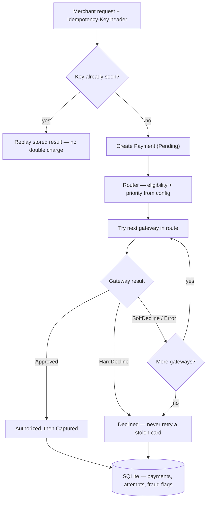
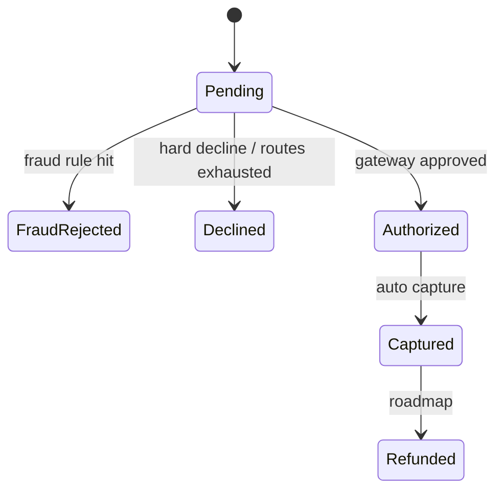
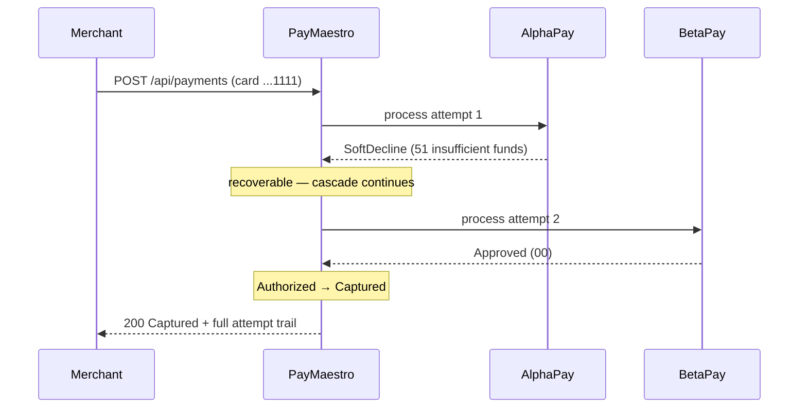

# PayMaestro — Mini Payment Orchestration API

A .NET study project on **payment orchestration**: one API in front of many payment gateways, with smart routing, cascading retries, database-enforced idempotency and an audit-first design — inspired by how orchestration platforms serve the iGaming space.

## Why this exists

Payment orchestration is the layer *above* payment gateways: the merchant integrates once, many acquiring routes sit behind it, and the platform adds the intelligence — picking the best route per transaction, retrying safely when a route fails, and keeping evidence of everything. I built PayMaestro over a weekend, **spec-first**, to understand that domain hands-on. Every design decision is documented in [docs/SPEC.md](docs/SPEC.md).

## The pipeline



## Payment lifecycle

Transitions are guarded **inside the aggregate** — an invalid transition throws a domain exception. There is no path back from `Captured`, and refunds only exist after capture (void vs refund).



## Cascading in action

Card ending `1111` is soft-declined by AlphaPay — a *recoverable* failure — so the orchestrator cascades and BetaPay saves the sale. A hard decline (card `0000`) would stop the cascade immediately: retrying a stolen card on another acquirer is not resilience.



## Key engineering decisions

**Idempotency is enforced by the database, not just the code.** The idempotency key has a unique index, so two concurrent retries are serialised by the database itself — the losing insert is caught and the stored outcome is replayed. A check-then-insert in application code alone has a race window between the read and the write.

**Hard vs soft declines drive the cascade policy.** Soft declines (insufficient funds, timeouts) and gateway errors cascade to the next route; hard declines (stolen or blocked cards) stop everything immediately.

**Routing is configuration, not code.** Gateway eligibility (supported currencies, amount caps) and priority live in `appsettings.json`, bound with the options pattern. Adding an acquirer is one class and one config entry — no business logic changes (open/closed principle).

**Rich domain model.** Private setters, factory creation and guarded transitions make invalid payment states unrepresentable by construction. My earlier projects used an anemic model; moving the invariants into the aggregate is a deliberate evolution.

**Audit-first persistence.** Every gateway attempt (gateway, order, result code, duration) and every fraud flag is persisted, and deletes are restricted at the database level — payment records are treated as regulatory evidence. If an acquirer issues an RFI, `GET /api/payments/{id}` returns the evidence pack. PCI-aware by design: only the BIN and last four digits are ever stored, never the full PAN.

**One class per reason to change.** The orchestrator coordinates the pipeline; `CascadeExecutor` owns the retry policy; each gateway implements a single Domain contract (dependency inversion — the Domain has zero external references).

## Architecture

Clean Architecture, modular monolith: `API → Application → Domain ← Infrastructure`. The Domain holds entities, the state machine and all contracts (gateways, fraud rules, repositories with read/write/update segregation and a unit of work); the Infrastructure implements them (EF Core + SQLite, mock gateways); the Application orchestrates use cases.

## Run it

```bash
dotnet run --project src/PayMaestro.API
# open the printed localhost URL + /swagger
```

`POST /api/payments` with header `Idempotency-Key: <any-uuid>` and body:

```json
{
  "merchantReference": "ORDER-001",
  "customerId": "customer-42",
  "amount": 50,
  "currency": "EUR",
  "cardNumber": "4111111111111111",
  "customerIp": "185.89.10.20"
}
```

| Card ending | Behaviour |
|---|---|
| `0000` | Hard decline everywhere — cascade stops, payment `Declined` |
| `1111` | Soft decline on AlphaPay — cascades to BetaPay |
| `2222` | Soft decline on BetaPay |
| `3333` | Gateway error on GammaPay |
| anything else | Approved on the first eligible gateway |

Also try: an amount above 5000 EUR (skips AlphaPay's cap — routing in action), a currency no gateway supports (declined with zero attempts), and the same `Idempotency-Key` twice (identical response, no second charge; same key with a *different* amount returns `422`).

## What's next

The fraud engine: the `IFraudRule` contract is already in the Domain, and three rules are specified in [docs/SPEC.md](docs/SPEC.md) — velocity (repeated declined attempts), geo mismatch (IP country vs card country) and amount anomaly. The rule design is informed by the iGaming Academy **Anti-Fraud & Payments Handling** certification ([docs/certificates](docs/certificates)). After that: unit tests for the state machine and cascade policy, then CI/CD to Azure Container Apps — the same pipeline as my [Sports Betting API](https://github.com/DeVFirmino/SportsBetting), which runs there today.
